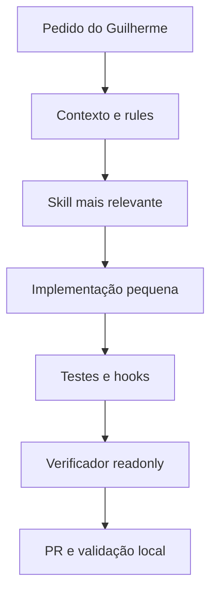

# Tutorial completo — Cursor SOTA para o POC Buddemeyer em Curitiba

> Versão do pacote: 2.0 — 8 de setembro de 2026

## 1. Resultado desta versão

Este pacote prepara o Cursor para investigar, modificar, testar e revisar o supervisório do pick-and-place com contexto específico do POC. A versão SOTA não depende apenas de prompts: combina conhecimento sob demanda com controles determinísticos e revisão separada.

Ao extrair o ZIP na raiz do repositório, serão instalados:

- 13 Agent Skills em `.cursor/skills/`;
- 3 Project Rules em `.cursor/rules/`;
- 1 subagente verificador somente leitura em `.cursor/agents/`;
- 2 hooks locais e seu manifesto `.cursor/hooks.json`;
- modelos de contexto técnico em `docs/project/`;
- arquitetura e prompts prontos em `docs/cursor-agent/`.



Esta estrutura melhora consistência e rastreabilidade. Ela **não** substitui análise de safety, permissivos/intertravamentos, HIL, procedimento de máquina ou autorização do responsável local.

## 2. Estrutura criada pelo ZIP

O ZIP foi construído sem pasta externa. A estrutura aparece diretamente no diretório onde ele for extraído:

```text
<raiz-do-repositorio>/
├── 00_LEIA_PRIMEIRO.md
├── TUTORIAL_INSTALACAO_E_SKILLS.md
├── .cursor/
│   ├── hooks.json
│   ├── agents/
│   │   └── industrial-change-verifier.md
│   ├── hooks/
│   │   ├── guard-industrial-commands.py
│   │   └── validate-edited-file.py
│   ├── rules/
│   │   ├── 00-poc-context-and-safety.mdc
│   │   ├── hardware-adapters.mdc
│   │   └── pyside-ui-architecture.mdc
│   └── skills/
│       ├── application/customize-buddemeyer-supervisory/SKILL.md
│       ├── calibration/validate-camera-robot-calibration/SKILL.md
│       ├── configuration/manage-buddemeyer-recipes-config/SKILL.md
│       ├── integration/validate-pick-place-cycle/SKILL.md
│       ├── network/debug-cip-ethernet-ip/SKILL.md
│       ├── plc/debug-nx102/SKILL.md
│       ├── release/package-release-buddemeyer/SKILL.md
│       ├── reliability/harden-buddemeyer-24x7/SKILL.md
│       ├── testing/debug-startup-restart/SKILL.md
│       ├── testing/test-buddemeyer-with-simulators/SKILL.md
│       ├── triage/incident-triage-buddemeyer/SKILL.md
│       ├── ui/develop-pyside6-supervisory-ui/SKILL.md
│       └── vision/validate-vision-inference/SKILL.md
└── docs/
    ├── cursor-agent/
    │   ├── ARQUITETURA_SOTA_CURSOR.md
    │   ├── AVALIACAO_ARQUIVOS_E_ESTRUTURA.md
    │   └── PROMPTS_CURSOR_POC.md
    └── project/
        ├── CODEBASE_MAP.md
        ├── INTERFACES_AND_STATE_MACHINE.md
        └── POC_CURITIBA_CONTEXT.md
```

As categorias como `application`, `testing` e `vision` servem apenas para organização. Para o Cursor, a identidade da skill é a pasta imediatamente acima de `SKILL.md`.

## 3. Pré-requisitos

Antes da atualização, Guilherme deve ter:

- acesso à raiz do repositório do POC;
- Git funcional;
- uma versão atual do Cursor com Agent Skills, Rules, Hooks e Subagents;
- Python 3 disponível como `python3`, usado pelos dois hooks;
- permissão para criar uma branch e abrir pull request;
- nenhuma expectativa de que a instalação faça alterações em hardware.

Confirme no terminal integrado do Cursor:

```bash
git rev-parse --show-toplevel
git status --short
python3 --version
```

O primeiro comando deve retornar exatamente a pasta aberta como projeto no Cursor. Se ele falhar, localize a raiz correta antes de extrair qualquer coisa.

## 4. Atualizar a instalação existente com segurança

### 4.1 Preserve o estado atual

Revise `git status`. Faça commit das mudanças válidas ou siga o procedimento da equipe para preservá-las. Não misture a atualização do Cursor com alterações funcionais não relacionadas.

Crie uma branch exclusiva, escolhendo outro nome se ela já existir:

```bash
git switch -c chore/cursor-sota-poc-curitiba
```

Se o repositório já contém `.cursor/hooks.json`, rules ou skills customizadas pelo time, compare-as antes da substituição. O Git permitirá revisar e recuperar cada diferença, mas a extração com `-o` atualiza arquivos de mesmo nome.

### 4.2 Copie e confira o ZIP

Coloque `cursor-sota-buddemeyer-poc-curitiba.zip` na raiz indicada por `git rev-parse --show-toplevel`. Confira que o arquivo contém `.cursor/` diretamente:

```bash
unzip -l cursor-sota-buddemeyer-poc-curitiba.zip | sed -n '1,80p'
```

A lista deve começar com caminhos como `.cursor/skills/...`, e não com `cursor-sota-buddemeyer-poc-curitiba/.cursor/...`.

### 4.3 Extraia na raiz

No macOS ou Linux:

```bash
unzip -o cursor-sota-buddemeyer-poc-curitiba.zip -d .
chmod +x .cursor/hooks/*.py
```

No Windows PowerShell, se o ambiente do POC for Windows:

```powershell
Expand-Archive -Path .\cursor-sota-buddemeyer-poc-curitiba.zip -DestinationPath . -Force
```

No Windows, confirme qual comando Python funciona. Se for `py -3` em vez de `python3`, ajuste somente o campo `command` das duas entradas em `.cursor/hooks.json` e registre essa adaptação no PR.

### 4.4 A pasta não apareceu no Finder

`.cursor` é oculta no macOS porque começa com ponto. Pressione `Command + Shift + .` no Finder. Pelo Terminal, a confirmação é inequívoca:

```bash
find .cursor -type f | sort
```

Se a estrutura estiver dentro de uma pasta intermediária, mova **o conteúdo** dessa pasta para a raiz do repositório e confirme que `.cursor` ficou imediatamente abaixo dela.

## 5. Validar a instalação

Execute na raiz:

```bash
find .cursor/skills -name SKILL.md | sort
find .cursor/skills -name SKILL.md | wc -l
find .cursor/rules -name '*.mdc' | wc -l
python3 -m json.tool .cursor/hooks.json >/dev/null
git diff --check
git status --short
```

Os números esperados são `13` skills e `3` rules.

Teste o gate de comandos com uma operação inofensiva:

```bash
printf '%s\n' '{"command":"pytest -q","workspace_roots":[]}' | python3 .cursor/hooks/guard-industrial-commands.py
```

Resultado esperado: JSON com `"permission": "allow"`.

Teste apenas a decisão do gate para uma frase simulada; o comando de exemplo não é executado:

```bash
printf '%s\n' '{"command":"deploy robot controller","workspace_roots":[]}' | python3 .cursor/hooks/guard-industrial-commands.py
```

Resultado esperado: JSON com `"permission": "ask"`.

Teste o validador no próprio arquivo:

```bash
printf '{"file_path":"%s/.cursor/hooks/validate-edited-file.py","workspace_roots":["%s"]}\n' "$PWD" "$PWD" | python3 .cursor/hooks/validate-edited-file.py
```

Resultado esperado: `{}` e código de saída zero.

## 6. Fazer o Cursor carregar tudo

1. Abra no Cursor a **raiz do repositório**, não somente uma subpasta do código.
2. Marque o workspace como confiável; hooks de projeto precisam dessa confiança para executar.
3. Salve os arquivos e abra uma nova conversa no Agent.
4. Se necessário, use `Developer: Reload Window` na Command Palette.
5. Em `Customize → Skills`, confirme as 13 skills na área `Agent Decides`.
6. Digite `/` no chat e procure `customize-buddemeyer-supervisory`, `test-buddemeyer-with-simulators` e `incident-triage-buddemeyer`.
7. Confira `.cursor/agents/industrial-change-verifier.md`; o Agent deve enxergá-lo como subagente disponível.
8. Abra a visualização/log de hooks do Cursor e faça os testes da seção anterior se houver dúvida.

Nenhuma skill possui `disable-model-invocation: true`; por isso, todas podem ser escolhidas automaticamente. O roteamento é uma decisão contextual do modelo, não uma garantia determinística. Para exigir uma skill, use `/nome-da-skill`.

## 7. Personalizar com o conhecimento real do POC

A instalação fornece estrutura e método, mas não deve inventar dados locais. Guilherme e os responsáveis devem revisar:

- `docs/project/POC_CURITIBA_CONTEXT.md`: componentes, versões, topologia e convenções;
- `docs/project/INTERFACES_AND_STATE_MACHINE.md`: sinais, produtores/consumidores, níveis/pulsos, estados, timeouts e recuperação;
- `docs/project/CODEBASE_MAP.md`: paths, entrypoints, classes, testes, build, arquivos gerados e ambientes.

Substitua `A confirmar` apenas por informação apoiada em código versionado, export Sysmac, manual aplicável, desenho aprovado ou teste registrado. Não inclua senha, token, chave privada ou segredo.

Quando os paths estiverem estáveis, o time pode restringir rules por `globs` ou skills por escopo. Faça isso em PR e somente com padrões encontrados no repositório; um glob incorreto pode excluir contexto necessário ou ativar instruções em arquivos demais.

## 8. As 13 skills, detalhadamente

### 8.1 `customize-buddemeyer-supervisory`

**Função:** é a porta de entrada para adicionar features ou alterar comportamento do aplicativo. Obriga o Agent a converter o pedido em resultado operacional e critérios observáveis, descobrir entrypoints/chamadores/contratos, mapear impacto e escolher uma mudança pequena.

**Quando usar:** nova tela, novo caso de uso, alteração de fluxo, integração de uma capacidade ou regra de negócio que atravessa mais de uma camada.

**Como trabalha:** preserva a separação UI → aplicação → domínio/FSM → adaptadores; verifica compatibilidade, estado, timeout, idempotência, freshness, testes e rollback. Pode combinar as skills de PySide6, simuladores, receitas e ciclo.

**Entrega esperada:** comportamento antes/depois, mapa de arquivos, decisão arquitetural, implementação, testes, riscos, itens não verificados e rollback.

### 8.2 `develop-pyside6-supervisory-ui`

**Função:** orienta telas, widgets, diálogos, sinais, slots, workers, timers e lifecycle do supervisório Qt/PySide6.

**Quando usar:** UI congelando, tela nova, interação do operador, atualização assíncrona, problema de thread, callback duplicado ou fechamento incompleto.

**Como trabalha:** confirma como a UI é gerada, evita editar artefatos derivados, mantém I/O e regra industrial fora dos widgets, protege o event loop e exige atualização de widgets na thread correta. Define ownership, cancelamento e limpeza de workers/timers.

**Testes:** estados de apresentação, validação, sinais/slots com `QSignalSpy` ou ferramenta existente, abertura/fechamento e vários ciclos de Start/Stop sem hardware.

### 8.3 `test-buddemeyer-with-simulators`

**Função:** cria uma estratégia determinística de testes com fakes/simuladores para câmera, preditor, relógio, NX102/CIP, robô e persistência.

**Quando usar:** qualquer feature/correção que precise ser comprovada offline, fault injection, replay ou regressão da FSM.

**Como trabalha:** identifica interfaces reais, usa injeção de dependência, controla relógio/latência/ordem, impede endpoints de produção por padrão e modela ACK, timeout, desconexão, dado obsoleto e restart.

**Limite:** teste verde em simulação não equivale a validação HIL ou autorização de movimento. A skill separa explicitamente unidade, componente Qt, integração simulada, contrato e HIL.

### 8.4 `manage-buddemeyer-recipes-config`

**Função:** trata receitas e configuração como contratos versionados e validados.

**Quando usar:** novos parâmetros, receita de produto, mudança de schema, unidade/limite, importação/exportação ou recuperação de arquivo inválido.

**Como trabalha:** descobre leitores, escritores, defaults e precedência; define tipos, faixas, unidades, versão e compatibilidade; separa receita, ambiente, calibração e segredo; exige gravação atômica, backup e migração testável.

**Invariante importante:** uma receita não muda silenciosamente no meio de um ciclo. A revisão ativa precisa ser reconciliada com estado seguro e, quando aplicável, registrada com `cycle_id`.

### 8.5 `package-release-buddemeyer`

**Função:** prepara build e release reproduzível, com manifesto, versões, checksums, testes, matriz de compatibilidade e rollback.

**Quando usar:** gerar instalador/pacote, preparar versão, documentar implantação ou planejar atualização do POC.

**Como trabalha:** parte de commit identificável e dependências travadas, exclui segredos/dados operacionais, executa smoke test do artefato e registra compatibilidade entre aplicativo, Qt/Python, modelo, schema, calibração e interface do CLP.

**Limite:** preparar release não autoriza `deploy`, transferência online, restart ou alteração de máquina. A liberação progride por bancada, simulação, HIL, piloto e produção conforme processo aprovado.

### 8.6 `incident-triage-buddemeyer`

**Função:** triagem inicial quando a causa ainda pode estar em aplicação, visão, calibração, NX102, rede, robô ou campo.

**Quando usar:** parada, intermitência ou comportamento anormal sem domínio causal demonstrado.

**Como trabalha:** normaliza relógios, constrói linha do tempo, coleta evidências somente leitura, identifica a primeira falha causal e limita a investigação a três hipóteses com evidência favorável/contrária e teste discriminante.

**Entrega esperada:** impacto, estado atual, evidências versus inferências, hipóteses ordenadas, próximo teste seguro, mitigação, correção/rollback e follow-up de RCA.

### 8.7 `debug-nx102`

**Função:** diagnóstico especializado do Omron NX102/Sysmac.

**Quando usar:** eventos, watchdog, saturação de tarefa, warm/cold start, retenção, I/O, EtherCAT, FSM ou blocos com `Done`, `Busy`, `Error` e `ErrorID`.

**Como trabalha:** exige modelo/unit version/firmware e versão Sysmac confirmados, correlaciona o primeiro evento causal, examina tarefas/estado/inicialização e diferencia controlador, barramento, rede, dispositivo e lógica.

**Limite:** comparação offline/online pode gerar evidência, mas não autoriza sincronizar, transferir, mudar modo, forçar variável, limpar erro ou reiniciar.

### 8.8 `debug-cip-ethernet-ip`

**Função:** investiga comunicação CIP sobre EtherNet/IP entre aplicação, NX102 e equipamentos.

**Quando usar:** timeout, perda, reconexão, tag data link instável, status CIP ou dado obsoleto/inconsistente.

**Como trabalha:** separa aplicação/freshness, sessão e caminho CIP, IP/Ethernet, switch, carga/RPI e camada física. Exige topologia, produtor/consumidor, tipo de conexão, tamanho, intervalo e timestamps.

**Limite:** não conclui “rede” apenas por timeout e não recomenda scan agressivo/flood/fuzzing em produção. RPI, QoS, IGMP, topologia e firmware só mudam após baseline e janela autorizada.

### 8.9 `harden-buddemeyer-24x7`

**Função:** revisão preventiva de confiabilidade e operação contínua.

**Quando usar:** elaborar backlog de robustez, observabilidade, recuperação, SLO/RTO/RPO, deploy e pontos únicos de falha; não é a primeira skill para incidente ativo desconhecido.

**Como trabalha:** avalia timeout, cancelamento, retry limitado, idempotência, circuit breaker, filas limitadas, estado seguro, liveness/readiness, logs, métricas, backup, rollback e testes de recuperação.

**Entrega esperada:** matriz de riscos com evidência/proprietário, backlog priorizado, dashboards/alertas e runbook. Não promete ausência total de falhas nem inventa SLOs.

### 8.10 `validate-pick-place-cycle`

**Função:** valida o ciclo ponta a ponta e o handshake aplicação–NX102–robô.

**Quando usar:** estado preso, comando duplicado, pulso perdido, ACK ambíguo, timeout, reinício em ciclo ou mudança da sequência ACK → Pick → Place → Complete.

**Como trabalha:** reconstrói produtor/consumidor, nível/pulso, condição de entrada/saída, timeout, erro e recuperação. Usa identidade de ciclo, impede repetição física indevida e rejeita coordenada/dado antigo.

**Testes:** happy path, peça ausente, visão indisponível, perda de comunicação, recusa do robô, timeout, restart por estado e ACK repetido.

### 8.11 `validate-vision-inference`

**Função:** avalia aquisição, preprocessamento, modelo/checkpoint, inferência, pós-processamento, seleção de alvo e publicação da coordenada.

**Quando usar:** alvo ausente/errado, confiança inadequada, frame antigo, latência ou divergência entre detecção e seleção final.

**Como trabalha:** registra versão/hash, dispositivo, resolução, espaço de cor, normalização, limiar e regra de seleção; distingue erro do modelo de erro de pós-processamento e mede cenários representativos.

**Entrega esperada:** estágio causal, dados reprodutíveis, métricas antes/depois, mudança, teste offline e rollback. Alterar modelo não substitui calibrar a relação câmera–robô.

### 8.12 `validate-camera-robot-calibration`

**Função:** valida a transformação entre imagem, plano de trabalho e referencial do robô.

**Quando usar:** erro pixel→milímetro, offset/escala/rotação, deslocamento nos cantos, mudança de câmera/poste, foco, resolução ou ferramenta/TCP.

**Como trabalha:** identifica se o modelo é escala/offset, afim, homografia ou calibração completa; verifica eixos/origens/unidades; separa pontos de ajuste e validação; calcula resíduos, RMSE, percentis e erro máximo por região.

**Entrega esperada:** modelo observado, dados válidos, mapa de erro, região não confiável, causa, tolerância aprovada, teste físico controlado e rollback da calibração.

### 8.13 `debug-startup-restart`

**Função:** diagnostica falhas que só aparecem depois de Stop/Start.

**Quando usar:** primeira abertura funciona, mas segunda inicialização perde câmera, modelo, conexão, eventos ou estado da FSM.

**Como trabalha:** compara as três fases, inventaria recursos adquiridos/liberados, verifica ordem/idempotência de `start`, `stop`, `close`, `join` e cancelamento, e procura singleton/global residual, flag, fila antiga, thread, porta, callback duplicado ou sessão expirada.

**Critério forte:** vários ciclos automatizados de reinicialização sem crescimento de threads/handles, duplicidade ou reaproveitamento de dados antigos.

## 9. O que fazem as três rules

### `00-poc-context-and-safety.mdc`

É sempre aplicada. Mantém o contexto industrial mínimo, exige consulta aos documentos do POC, separa fato de hipótese e proíbe que o Agent invente parâmetros. Também exige mudança pequena, teste, risco e rollback e impede que análise seja confundida com autorização de operação.

### `pyside-ui-architecture.mdc`

É aplicada inteligentemente em trabalhos de PySide6/Qt. Mantém a UI sem I/O industrial direto, protege o event loop, define política de sinais/slots/threads e exige lifecycle/testes. Não é sempre carregada para não ocupar contexto em tarefas puramente de rede ou calibração.

### `hardware-adapters.mdc`

É aplicada inteligentemente quando o código toca câmera, visão, NX102/CIP, robô ou campo. Exige interfaces estreitas, lifecycle explícito, timeouts, idempotência, freshness e testes simulados. Proíbe bypass de safety e valores industriais inventados.

## 10. O que fazem hooks e subagente

### Gate `beforeShellExecution`

`.cursor/hooks/guard-industrial-commands.py` lê o comando que o Agent pretende executar. Operações comuns de leitura/teste são permitidas. Comandos destrutivos, alterações de rede ou combinações de verbo mutável com alvo industrial retornam `ask`, fazendo o Cursor solicitar confirmação.

O hook usa `failClosed: true`: se o processo não puder ser executado, a operação avaliada não deve prosseguir automaticamente. Por isso, valide `python3` após instalar. O detector é uma camada auxiliar baseada em padrões; pode ter falso positivo ou não reconhecer uma ferramenta específica. Nunca o trate como intertravamento certificado.

### Check `afterFileEdit`

`.cursor/hooks/validate-edited-file.py` executa checagem rápida e sem dependências depois de uma edição do Agent:

- sintaxe Python via AST, sem gerar `__pycache__`;
- JSON;
- TOML quando `tomllib` estiver disponível;
- frontmatter mínimo de `SKILL.md` e `.mdc`.

Ele não substitui lint, type-check ou testes e não garante reversão automática de uma edição já feita.

### `industrial-change-verifier`

O subagente revisa o diff em contexto separado e com `readonly: true`. Ele procura regressões, chamadas bloqueantes, races, cleanup incompleto, FSM/ACK/freshness, schema/migração, segredos, compatibilidade e qualidade dos testes. Classifica achados por severidade e termina com `APROVADO`, `APROVADO COM RESSALVAS` ou `NÃO APROVADO`.

Independência reduz viés, mas não substitui code review, responsável de automação ou validação local.

## 11. Prompts prontos para Guilherme

Abra `docs/cursor-agent/PROMPTS_CURSOR_POC.md`. O arquivo contém:

- bloco comum de engenharia e segurança;
- prompt completo, exemplo preenchido e versão curta para adicionar feature;
- prompt completo, exemplo e versão curta para customizar função;
- prompt completo, exemplo e versão curta para resolver problema;
- prompt de revisão final com o subagente;
- casos para testar o roteamento automático.

Para a primeira utilização, prefira o modelo completo. Depois que o contexto do repositório estiver bem preenchido, as versões curtas funcionam para mudanças localizadas.

## 12. Fluxo diário recomendado

1. Abra uma branch e confirme árvore de trabalho.
2. Escreva objetivo, critérios de aceite, não objetivos e limites.
3. Peça **Plan** e mapa de impacto antes de qualquer edição relevante.
4. Confirme decisões bloqueantes.
5. Implemente o menor incremento.
6. Execute unidade, Qt e integração simulada aplicáveis.
7. Rode lint/type-check/testes oficiais registrados em `CODEBASE_MAP.md`.
8. Acione `industrial-change-verifier` em modo somente leitura.
9. Corrija bloqueadores e achados altos do escopo.
10. Revise `git diff`, riscos, rollback e itens que ainda exigem HIL.
11. Abra PR e obtenha revisão técnica/humana.
12. Faça bancada/HIL/POC somente sob procedimento e autorização locais.

## 13. Testar o acionamento automático

Use conversas novas, sem escrever o nome da skill:

| Pedido | Roteamento esperado |
|---|---|
| “Adicione um histórico de ciclos com filtros e exportação.” | `customize-buddemeyer-supervisory` |
| “A tela congela enquanto a inferência roda.” | `develop-pyside6-supervisory-ui` |
| “Teste timeout e ACK duplicado sem o NX102 real.” | `test-buddemeyer-with-simulators` |
| “Versione o schema das receitas e crie migração.” | `manage-buddemeyer-recipes-config` |
| “Prepare build reproduzível e rollback.” | `package-release-buddemeyer` |
| “A célula parou e a causa ainda é desconhecida.” | `incident-triage-buddemeyer` |
| “O NX102 teve watchdog após warm start.” | `debug-nx102` |
| “Há timeout CIP e dado antigo após reconexão.” | `debug-cip-ethernet-ip` |
| “Crie um backlog de robustez 24×7.” | `harden-buddemeyer-24x7` |
| “Revise ACK, Pick, Place e Complete.” | `validate-pick-place-cycle` |
| “O preditor escolheu o alvo errado.” | `validate-vision-inference` |
| “O erro em milímetros cresce nos cantos.” | `validate-camera-robot-calibration` |
| “Funciona no primeiro Start e falha no segundo.” | `debug-startup-restart` |

Se a seleção estiver ambígua, refine a descrição da skill em PR ou use `/nome-da-skill` para aquele pedido. Não duplique uma skill apenas para “forçar” o Agent.

## 14. Revisar e versionar

```bash
git diff --check
git diff -- .cursor docs 00_LEIA_PRIMEIRO.md TUTORIAL_INSTALACAO_E_SKILLS.md
git add .cursor docs 00_LEIA_PRIMEIRO.md TUTORIAL_INSTALACAO_E_SKILLS.md
git commit -m "chore: upgrade Cursor guidance for Curitiba POC"
git push -u origin chore/cursor-sota-poc-curitiba
```

Não inclua o ZIP dentro do repositório, salvo se a política do projeto exigir. O conteúdo extraído é a fonte versionada e revisável.

## 15. Solução de problemas

### `.cursor` não aparece

Use `Command + Shift + .` no Finder ou `find .cursor -type f`. Se o Terminal também não encontrar, a extração ocorreu no diretório errado.

### Só algumas skills aparecem

Confirme 13 arquivos chamados exatamente `SKILL.md`, abra a raiz correta, recarregue a janela e inicie uma conversa nova. Verifique se o YAML tem `name` e `description` e se a pasta da skill coincide com `name`.

### O Agent não seleciona a skill esperada

O roteamento é semântico. Teste o prompt curto da tabela, torne o pedido específico e confira se duas descrições estão se sobrepondo. Para uso imediato, invoque `/skill`. Ajuste descrições por evidência, sem transformar todas em instruções genéricas.

### Todo comando de shell está sendo recusado

Execute `python3 --version` fora do Cursor e teste o hook manualmente. Como o gate é fail-closed, falha do interpretador ou JSON inválido pode impedir a ação. Corrija o caminho do Python em `.cursor/hooks.json`; não desative o controle silenciosamente. Se for necessário suspender o hook para diagnóstico, faça isso com aprovação do time, mudança visível no Git e restauração posterior.

### O hook pede confirmação demais

Capture o comando e ajuste os padrões de leitura no script em PR. Não remova o gate inteiro por causa de um falso positivo isolado.

### A UI/tecnologia real não é PySide6

Não force a skill. Confirme o framework em `CODEBASE_MAP.md`, desative ou substitua a rule/skill de UI por uma versão compatível, mantendo os invariantes de separação, concorrência e teste.

## 16. Critérios de aceite da atualização

- `.cursor/` existe diretamente na raiz;
- 13 skills aparecem em `Customize → Skills → Agent Decides` e por `/`;
- 3 rules são reconhecidas;
- o subagente verificador está disponível e é somente leitura;
- o gate retorna `allow` para teste e `ask` para o exemplo industrial;
- o validador pós-edição retorna `{}` para arquivo válido;
- os três documentos em `docs/project/` foram revisados e têm responsáveis para itens pendentes;
- os prompts de feature, customização e problema foram testados;
- o diff passou por PR e revisão humana;
- nenhuma ação online em CLP, robô, rede ou safety foi executada pela simples instalação.

## 17. Fontes oficiais

- Cursor Agent Skills: https://cursor.com/docs/skills
- Cursor Project Rules: https://cursor.com/docs/rules
- Cursor Hooks: https://cursor.com/docs/hooks
- Cursor Subagents: https://cursor.com/docs/subagents
- Cursor Agent Security: https://cursor.com/docs/agent/security
- Agent Skills Specification: https://agentskills.io/specification
- Qt for Python Signals and Slots: https://doc.qt.io/qtforpython-6/tutorials/basictutorial/signals_and_slots.html
- Qt for Python QSignalSpy: https://doc.qt.io/qtforpython-6/PySide6/QtTest/QSignalSpy.html
