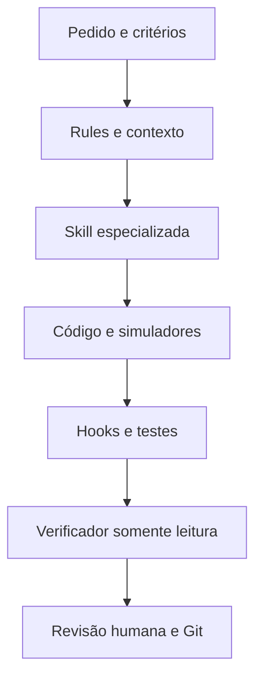

# Arquitetura SOTA do Cursor — POC Buddemeyer Curitiba

## Objetivo

Transformar o Cursor em um assistente especializado no repositório sem tratá-lo como autoridade de safety ou permitir que instruções em linguagem natural substituam testes e aprovação humana.

O pacote adota defesa em profundidade e divulgação progressiva de contexto: uma regra curta e permanente define os invariantes; skills específicas são carregadas conforme a intenção; verificações determinísticas detectam problemas objetivos; um subagente independente revisa a mudança; Git preserva auditoria e rollback.

## Camadas e responsabilidades

| Camada | Local | Responsabilidade | Não substitui |
|---|---|---|---|
| Contexto permanente | `.cursor/rules/00-poc-context-and-safety.mdc` | Evidência, limites e invariantes gerais | Procedimento de safety |
| Regras especializadas | `.cursor/rules/*.mdc` | Padrões de PySide6 e adaptadores de hardware | Revisão arquitetural |
| Skills | `.cursor/skills/**/SKILL.md` | Workflow e conhecimento sob demanda | Código/teste executável |
| Hooks | `.cursor/hooks.json` e `.cursor/hooks/` | Gate de comandos arriscados e checks rápidos pós-edição | Intertravamentos ou CI |
| Subagente | `.cursor/agents/industrial-change-verifier.md` | Revisão independente e somente leitura | Aprovação técnica humana |
| Contexto do projeto | `docs/project/` | Fatos locais, contratos e comandos confirmados | Fonte primária quando desatualizada |
| Prompts | `docs/cursor-agent/PROMPTS_CURSOR_POC.md` | Pedidos consistentes e verificáveis | Critérios de engenharia |

## Por que 13 skills

As oito skills originais revisadas cobrem diagnóstico e confiabilidade. Cinco novas skills fecham o ciclo de mudança do aplicativo: especificação/implementação, interface PySide6, validação simulada, configuração/receitas e build/release.

Elas continuam separadas porque descrições discriminantes melhoram o roteamento automático e evitam carregar todo o manual em cada conversa. Uma skill ampla demais tende a competir com as demais e diluir limites importantes.

## Decisões deliberadas

- Skills ficam em `.cursor/skills/` no projeto para acompanhar branch, clone, PR e Cloud Agent ligado ao repositório.
- Pastas de categoria são organizacionais; a identidade é o diretório imediatamente acima de `SKILL.md`.
- Nenhuma skill contém `disable-model-invocation: true`; portanto, o Agent pode selecioná-las automaticamente. `/nome-da-skill` continua disponível para seleção explícita.
- As rules PySide6 e hardware usam aplicação inteligente enquanto os caminhos reais não forem conhecidos. Depois de preencher `CODEBASE_MAP.md`, o time pode adicionar globs específicos revisados.
- O verificador usa `readonly: true`, mantendo a revisão separada de quem implementou.
- Os hooks usam apenas a biblioteca padrão do Python. O gate de shell retorna `ask`, e não executa ou bloqueia silenciosamente a ação pretendida.
- O gate é um controle de desenvolvimento. Ele não é certificado, não conhece todos os comandos possíveis e não deve ser tratado como função de segurança de máquina.

## Evolução recomendada

1. Preencher os documentos de `docs/project/` com fatos confirmados.
2. Medir quais prompts acionam cada skill e reduzir sobreposições de descrição.
3. Quando os caminhos forem estáveis, aplicar escopo por `paths` nas skills ou `globs` nas rules.
4. Mover validações específicas e repetíveis para scripts/testes do próprio repositório.
5. Integrar os mesmos checks ao CI; hook local não garante que todos os commits passaram por eles.
6. Manter alterações em branch e exigir PR para rules, skills, hooks e agentes.
7. Revisar o pacote após mudanças relevantes no Cursor, PySide6, arquitetura do POC ou processo de release.

## Referências oficiais consultadas

- Cursor Agent Skills: https://cursor.com/docs/skills
- Cursor Project Rules: https://cursor.com/docs/rules
- Cursor Hooks: https://cursor.com/docs/hooks
- Cursor Subagents: https://cursor.com/docs/subagents
- Qt for Python Signals and Slots: https://doc.qt.io/qtforpython-6/tutorials/basictutorial/signals_and_slots.html
- Qt for Python QSignalSpy: https://doc.qt.io/qtforpython-6/PySide6/QtTest/QSignalSpy.html

Arquitetura revisada em 8 de setembro de 2026.
