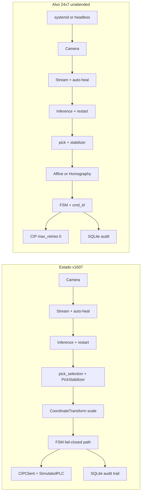

# Avaliação 24×7 — Pick-and-Place Industrial

| Campo | Valor |
|--------|--------|
| **Autor** | Realtec |
| **Data** | 2026-07-21 |
| **Estado** | parcial (P0 implementado; backlog P2 / aceitação 24×7 aberto) |
| **Versão do sistema** | Buddmeyer Vision System v2.0 — baseline v1607 |
| **Escopo** | Avaliação módulo a módulo; status do roadmap P0–P2 para operação contínua |

---

## 1. Objetivo deste documento

Este documento consolida a **avaliação técnica** do Realtec Vision Buddmeyer para operação **24 horas × 7 dias** em pick-and-place industrial. Cobre:

- Diagnóstico do estado atual por módulo
- Gaps em relação às melhores práticas de visão + motion
- Roadmap priorizado (P0–P2) com **estado de implementação** (jul/2026)
- Feature de **integração de coordenadas** com robô/CLP (scale v1 feito; affine/homography abertos)

**Princípios orientadores:** estabilidade, resiliência, simplicidade, fácil manutenção e entendimento.

**Fora de escopo nesta fase:** integração direta com driver de robô (TCP/UDP, trajetória, compensação Z dinâmica).

---

## 2. Diagnóstico executivo

O sistema já possui uma **base sólida** para pick-and-place com visão, e a **Fase 0 / parte da Fase 1** do roadmap já está **implementada** na baseline v1607:

- Pipeline Mask2Former bem instrumentado (`detection/`) — ver [MODELO_MASK2FORMER.md](MODELO_MASK2FORMER.md)
- FSM com handshake endurecido (`control/robot_controller.py`) — [FEATURE_FSM_HANDSHAKE_HARDENING.md](FEATURE_FSM_HANDSHAKE_HARDENING.md)
- Contrato de tags documentado (`docs/TAG_CONTRACT.md` v1.1)
- Seleção de pick por paralaxe + PickStabilizer — [FEATURE_PICK_SELECTION_PARALLAX.md](FEATURE_PICK_SELECTION_PARALLAX.md), [FEATURE_PICK_STABILIZER.md](FEATURE_PICK_STABILIZER.md)
- `production_mode` fail-closed — [FEATURE_PRODUCTION_MODE.md](FEATURE_PRODUCTION_MODE.md)
- Stream / inference auto-restart; audit SQLite (`core/audit_store.py`); log rotation
- Coordinate scale v1 (`coordinate/transform.py`) — [FEATURE_COORDINATE_MAPPING.md](FEATURE_COORDINATE_MAPPING.md)

Para **24×7 industrial desacompanhado**, os gaps restantes **não são de algoritmo de visão**, mas de:

1. **Watchdog de processo** — sem systemd / modo headless / health endpoint
2. **Calibração avançada** — affine/homography, wizard e export ainda abertos
3. **Aceitação de campo** — soak 72 h e critérios da secção 11 ainda não fechados
4. **Defaults de campo** — `config.yaml` shipped ainda com `production_mode: false` e `cip.max_retries: 3` (finito)

**Conclusão:** adequado para **piloto supervisionado / FAT de software** (incluindo SimulatedPLC). Para operação contínua desacompanhada, falta hardening P2 + critérios de aceitação da secção 11.

### 2.1 Arquitetura atual vs. alvo 24×7



### 2.2 Mapa de camadas

| Camada | Path | Responsabilidade |
|--------|------|------------------|
| Entrada | `main.py` | Bootstrap Qt, logging, event loop |
| UI / HMI | `ui/` | Operação, configuração, diagnósticos, overlay |
| Controle | `control/` | FSM pick-and-place, handshake CLP |
| Visão | `detection/` | Modelo, inferência, geometria, seleção de pick |
| Pré-processamento | `preprocessing/` | ROI, clamp de centroide |
| Streaming | `streaming/` | Captura, adapters, health, MJPEG |
| CLP | `communication/` | CIP client, tag map, SimulatedPLC |
| Config | `config/` | Pydantic + YAML |
| Infra | `core/` | Logs, métricas, exceções, audit SQLite |
| Coordenadas | `coordinate/` | px→mm (scale v1) |
| Testes | `tests/`, `scripts/` | Unitários, smoke tests |

---

## 3. Avaliação por módulo

### 3.1 Config — `config/settings.py`

**Responsabilidade:** fonte única de configuração tipada (Pydantic), persistência YAML, override por variáveis de ambiente (`BUDDMEYER__`).

**Pontos fortes:**

- Tipagem forte e validadores (device, pick method, area unit, source type)
- Nomes de tags CLP configuráveis sem alterar código
- Migração legada (`prioritize_area` → `pick_selection_method`, `px_per_mm` → `mm_per_px`)
- Separação clara: UI edita em memória; persistência explícita na aba Configuração

**Gaps 24×7:**

- Singleton sem versionamento de schema; risco de drift memória vs disco
- Sem perfis de operação (`pilot` vs `production`) que alterem comportamento crítico (ex.: bloquear SimulatedPLC)
- Parâmetros de resiliência espalhados (CIP, stream, robot) sem grupo unificado

**Propostas:**

- Adicionar `ReliabilitySettings`: `production_mode`, `max_plc_reconnect_attempts` (0 = infinito), `stream_auto_restart`, `inference_auto_restart`
- Adicionar `config_version: int` no YAML com validação na carga
- `production_mode=true` → fail-closed, sem fallback SimulatedPLC, safety tags obrigatórias

---

### 3.2 Core — `core/logger.py`, `core/metrics.py`, `core/exceptions.py`

**Responsabilidade:** logging estruturado, métricas in-memory, hierarquia de exceções de domínio.

**Pontos fortes:**

- structlog com correlation IDs e timestamps UTC
- Trilho `process_trace.log` para correlação de ciclos (`cycle_id`, `frame_id`, transições)
- Métricas de FPS, latência inferência, latência CIP, contadores de ciclo
- Exceções tipadas: `StreamError`, `InferenceError`, `CIPError`, `RobotControlError`

**Gaps 24×7:**

- Métricas perdidas no restart; sem alertas externos
- Sem rotação/size cap explícita nos logs (risco de disco cheio em semanas)
- FSM usa `get_logger` mas não `trace_event()` de forma consistente

**Propostas:**

- `RotatingFileHandler` configurável (ex.: 50 MB × 10 arquivos) em `LoggingSettings`
- Export periódico de métricas agregadas para SQLite ou CSV diário (sem PostgreSQL nesta fase)
- Padronizar transições FSM e falhas críticas via `trace_event(cycle_id=..., state_from=..., state_to=...)`

---

### 3.3 Streaming — `streaming/`

**Responsabilidade:** captura de frames via adapters (vídeo, USB, RTSP, GigE, GenTL), buffer, monitoramento de saúde, servidor MJPEG.

**Pontos fortes:**

- Padrão adapter isola backends de câmera
- Cópia defensiva de frames (`ascontiguousarray`) evita bugs cross-thread
- Warmup USB descarta frames pretos/uniformes
- `StreamHealth` monitora FPS, drops e timeout (default 5 s)
- Suporte GenTL para câmeras industriais Omron Sentech

**Gaps 24×7:**

- Health é **observacional** — status `UNHEALTHY` não dispara reopen do adapter
- Worker faz sleep 0.5 s em erro mas não escala para restart estruturado
- RTSP existe no código mas não está exposto na UI Operação

**Propostas:**

- `StreamRecoveryPolicy` em `StreamManager`: após N timeouts ou `UNHEALTHY` por T segundos → `stop()` → `change_source()` → `start()` com backoff exponencial
- Sinal Qt `stream_recovery_attempted` para banner na UI
- Expor RTSP na combo Fonte (Operação)

---

### 3.4 Detection — `detection/`

**Responsabilidade:** carregamento de modelo Mask2Former, inferência em QThread, pós-processamento de máscaras, geometria (PCA), seleção de pick, contratos de evento.

**Pontos fortes:**

- Diagnósticos ricos: `inference_diagnostic`, detecção de frame congelado (hash), dumps opcionais em `logs/diagnostic_samples/`
- `DetectionResult` com campos de diagnóstico (`max_query_score`, `rejected_by_class`, etc.)
- Seleção determinística de pick com log `pick_target_selected`
- Fallback para object detection se modelo não for segmentação
- Boa cobertura de testes (segmentation, geometry, pick selection, overlay)

**Gaps 24×7:**

- Decisão de pick **por frame único** — flicker em limiar de confiança
- Modelo carregado na GUI thread (bloqueio 1–2 min no cold start)
- Inferência em frame completo mesmo com ROI ativo (custo CPU/GPU)
- Worker sem restart após erros repetidos ou OOM GPU

**Propostas:**

- `PickStabilizer`: exige M frames consecutivos com mesmo alvo (centroide dentro de ε px) antes de emitir `DetectionEvent` consumível pelo FSM; defaults sugeridos: `stable_frames=3`, `centroid_epsilon_px=15`
- `InferenceEngine.restart_worker()`: após K erros consecutivos, recria QThread e recarrega modelo
- Carregamento de modelo em QThread dedicado com indicador de progresso
- Opcional P2: crop de inferência dentro do ROI (+ margem)

---

### 3.5 Preprocessing — `preprocessing/roi_manager.py`

**Responsabilidade:** definição de ROI, transformações ROI↔frame, clamp ortogonal de centroide.

**Pontos fortes:**

- Clamp de segurança antes do envio ao CLP (projeção ortogonal ao retângulo ROI)
- ROI ajustável na aba Operação durante produção
- Transformações de coordenadas e bounding box entre ROI e frame

**Gaps 24×7:**

- Calibração **escalar única** (`roi_calibration_mm_per_px`) — insuficiente para integração robótica precisa
- Lógica de conversão px→mm **duplicada** em 4 locais: `robot_controller`, `operation_page`, `inference_engine`, `status_panel`

**Propostas:**

- Centralizar conversão no módulo `coordinate/` (ver secção 8)
- Manter ROI como zona de segurança; calibração geométrica separada da ROI

---

### 3.6 Communication (CLP) — `communication/cip_client.py`

**Responsabilidade:** comunicação CIP/EtherNet-IP com Omron NX102, whitelist de tags, SimulatedPLC para desenvolvimento.

**Pontos fortes:**

- Whitelist previne escritas acidentais
- Retries I/O configuráveis (`io_retries`, default 2)
- Auto-reconnect com timer e heartbeat toggle
- SimulatedPLC modela timing realista de pick/place (~4 s / ~5 s)
- `write_detection_result()` escreve batch atômico de tags de visão
- Contrato documentado em `docs/TAG_CONTRACT.md`

**Gaps 24×7 (críticos):**

- Reconnect limitado a 3 tentativas (`max_retries`)
- Fallback silencioso para `SimulatedPLC` — **inaceitável em produção**
- Tags `VisionError`, `SystemFault`, safety (`SafetyGateClosed`, `SafetyAreaClear`, `SafetyLightCurtainOK`) definidas mas **não usadas** na FSM
- `_check_safety()` é fail-open em erro de leitura:

```python
async def _check_safety(self) -> bool:
    try:
        emergency = await self._cip_client.read_tag("PlcEmergencyStop")
        if emergency:
            return False
        return True
    except Exception:
        return True  # Assume seguro se não conseguir ler
```

**Propostas:**

- `production_mode`: se CLP real indisponível → `SystemFault=true`, FSM → `ERROR`, **sem** SimulatedPLC
- Reconnect com backoff exponencial infinito (cap 60 s), contador exposto na UI Diagnósticos
- Ler tags de safety; fail-closed se leitura falhar em production
- Escrever `VisionError`/`SystemFault`/`VisionBusy` em todos os caminhos de falha conhecidos
- P2: `pc_cmd_id`/`plc_ack_id` para idempotência (previsto em TAG_CONTRACT)

---

### 3.7 Control (FSM) — `control/robot_controller.py`

**Responsabilidade:** máquina de estados do ciclo pick-and-place, handshake com CLP, timeouts, registro de steps.

**Estados:**

```
STOPPED → INITIALIZING → WAITING_AUTHORIZATION → DETECTING
  → [WAITING_SEND_AUTHORIZATION (manual)] → SENDING_DATA → WAITING_ACK
  → ACK_CONFIRMED → WAITING_PICK → WAITING_PLACE → WAITING_CYCLE_START
  → READY_FOR_NEXT → (loop)
Error paths: ERROR, TIMEOUT, SAFETY_BLOCKED
```

**Pontos fortes:**

- Transições validadas via `VALID_TRANSITIONS`
- Timeouts configuráveis (ACK 5 s, pick/place 30 s, autorização 30 s)
- Recovery ERROR → INITIALIZING após 5 s
- Registro de steps por ciclo para auditoria in-session
- Clamp ROI + conversão mm no momento do envio

**Gaps 24×7:**

- `process_detection` aceita **qualquer** frame em DETECTING — sem estabilização temporal
- `authorization_timeout` → allow implícito (risco em produção)
- Inferência continua durante WAITING_ACK/PICK/PLACE (desperdício e confusão operacional)
- Tag `RobotError` não tratada
- **Envio duplicado de coordenadas:** FSM **e** `operation_page._communicate_centroid_to_plc` (a cada 25 frames) — anti-padrão pick-and-place

**Propostas:**

- Remover envio periódico paralelo; único caminho: FSM → `write_detection_result`
- Pausar consumo de detecções fora de `DETECTING` (flag `pick_locked` no InferenceEngine)
- Tratar `RobotError` → `ERROR` + `SystemFault`
- `authorization_timeout` em production → `TIMEOUT` (não allow implícito)
- Persistir `cycle_summary` em SQLite

---

### 3.8 UI — `ui/`

**Responsabilidade:** interface desktop PySide6 (Operação, Configuração, Diagnósticos), overlay de detecção, painel de status, orquestração runtime.

**Pontos fortes:**

- Intenção ISA-101: alarmes em destaque, contadores em Diagnósticos
- Shutdown idempotente testado (`test_shutdown.py`)
- Preload de modelo na abertura da app
- Overlay multi-objeto com mm/cm²; envio CLP de alvo único (paralaxe)
- Dialog GenTL para tuning de câmera industrial

**Gaps 24×7:**

- Dependência de desktop GUI (sem modo headless/service)
- Banner de alarme não consolida todos os estados críticos (stream unhealthy + CLP degraded + safety blocked)
- SimulatedPLC mostra warning mas sistema pode continuar aparentemente operacional

**Propostas:**

- `SystemHealthBanner` unificado: agrega stream + CLP + FSM + safety; impede "Iniciar" em production se pré-condições falharem
- Modo `--headless` ou auto-start Operação via config (box PC com systemd)
- Kiosk: fullscreen + desabilitar tabs Config em production

---

### 3.9 Persistência — (inexistente)

**Gap:** zero audit trail entre restarts; impossível RCA (root cause analysis) de falhas noturnas.

**Proposta mínima:**

- SQLite local `logs/audit.db` via stdlib `sqlite3`
- Tabelas: `cycles`, `faults`, `config_changes`
- Sem PostgreSQL nesta fase — simplicidade e manutenção local; migrável depois

---

### 3.10 Deploy / Operação externa — `installer/`, docs

**Gap:** nenhum watchdog de processo no repositório.

**Propostas:**

- Unit file systemd exemplo (`Restart=always`, `WatchdogSec=30`, `StartLimitIntervalSec=0`)
- Endpoint `/health` mínimo ou reutilizar MJPEG para supervisor externo
- Checklist soak test 72 h documentado em `docs/RUNBOOK_24x7.md` (a criar na implementação)

---

### 3.11 Testes — `tests/`

**Pontos fortes:** 17 módulos de teste; boa cobertura de geometria, pick, config, shutdown, USB warmup, overlay.

**Gaps:**

- Sem teste integrado FSM + CIP simulado end-to-end
- Sem teste de recovery (stream restart, inference restart)
- Sem soak/memory test

**Propostas:**

- `test_fsm_handshake.py`: ciclo completo com SimulatedPLC
- `test_stream_recovery.py`, `test_pick_stabilizer.py`, `test_coordinate_transform.py`
- Script `scripts/soak_test.sh` (opcional CI nightly)

---

## 4. Padrões de resiliência — estado atual

| Concern | Implementação atual | Gap para 24×7 |
|---------|---------------------|---------------|
| PLC reconnect | Auto-reconnect após degraded; max 3 tentativas | Sem retry infinito; sem alerta claro |
| PLC I/O retry | 2 retries por operação | Adequado para transientes |
| PLC heartbeat | Toggle VisionHeartbeat | Sem watchdog se CLP para de ler |
| Stream health | FPS/drop/timeout | Sem auto-restart |
| USB black frames | Warmup discard | Adequado |
| Inference errors | Log + signal | Sem worker restart |
| FSM errors | ERROR → re-init 5 s | Sem escalation SystemFault |
| Safety | Emergency stop only | Light curtain/gate não usados |
| Shutdown | Idempotente testado | Adequado |
| Process watchdog | Externo (não no repo) | Precisa systemd/supervisor |
| Failover CLP | SimulatedPLC fallback | Perigoso em produção |

---

## 5. Contratos de dados e fluxo de eventos

### 5.1 Dataclasses principais (`detection/events.py`)

| Tipo | Papel |
|------|-------|
| `Detection` | Objeto único: bbox, máscara, centroide, ângulo, área, confiança |
| `DetectionResult` | Saída completa de um frame + diagnósticos |
| `DetectionEvent` | Evento PLC-facing: alvo de pick + detecções escaladas para overlay |

### 5.2 Payload CLP (`DetectionEvent.to_plc_data()`)

```python
{
  "product_detected", "centroid_x", "centroid_y",
  "confidence", "angle_deg", "area_px",
  "detection_count", "processing_time"
}
```

O `RobotController` aplica escala px→mm, clamp ROI e unidade de área antes de `write_detection_result()`.

### 5.3 Sinais Qt (fluxo principal)

| Emissor | Sinal | Consumidor |
|---------|-------|------------|
| StreamManager | `frame_available` | OperationPage → InferenceEngine |
| InferenceEngine | `detection_result` | Overlay |
| InferenceEngine | `detection_event` | RobotController + status panel |
| RobotController | `state_changed`, `cycle_completed` | UI |
| CIPClient | `connected`, `connection_error` | UI/diagnósticos |

---

## 6. Melhores práticas pick-and-place (estado da arte)

Práticas alinhadas ao domínio industrial — status na baseline v1607:

| Prática | Situação no projeto | Status |
|---------|---------------------|--------|
| Separação visão/motion | FSM orquestra; vision produz pose; sem driver de robô | Parcial (ok para CLP) |
| Handshake explícito | FSM + fault tags (`VisionError` / `SystemFault`) | **Feito** (P0) |
| Temporal filtering | `PickStabilizer` (`stable_frames`) | **Feito** |
| Watchdog em camadas | Stream + inference + CIP; sem systemd/headless | Parcial |
| Audit trail | SQLite `logs/audit.db` | **Feito** |
| Fail-closed safety | `reliability.production_mode` | **Feito** (default shipped = off) |
| Calibração verificável | Scale v1 (`coordinate/`); affine/homography abertos | Parcial |
| Um caminho de comando | Só FSM; envio paralelo UI removido | **Feito** |

---

## 7. Princípios de design

1. **Um caminho, uma responsabilidade** — detecção escolhe alvo; transform converte; FSM orquestra; CLP transporta
2. **Fail-closed em production** — dúvida ou falha de leitura = parar, não assumir seguro
3. **Recuperação automática com limites observáveis** — restart stream/inference sim; magia silenciosa não
4. **Config explícita > heurística** — debounce, timeouts, calibração são parâmetros YAML
5. **SQLite antes de PostgreSQL** — audit local suficiente para v1 24×7
6. **SimulatedPLC só em dev** — guarda rígida com `production_mode`

---

## 8. Coordinate Mapping Layer — status

### 8.1 Objetivo

Facilitar integração com robô/CLP **sem implementar driver de robô**. Eliminar duplicação de conversão px→mm e ir além do escalar `mm_per_px`.

### 8.2 Status v1607

| Item | Status |
|------|--------|
| Módulo `coordinate/transform.py` (modo **scale**) | **Implementado** |
| Spec [FEATURE_COORDINATE_MAPPING.md](FEATURE_COORDINATE_MAPPING.md) | **Implementado** (v1 scale) |
| Affine / Homography + wizard UI + export JSON | **Aberto** (P2) |
| `TAG_CONTRACT.md` v1.1 (mm + ângulo + área) | **Feito** |

Pipeline atual (scale):

```
pixel (centróide máscara) → CoordinateTransform scale → clamp ROI → tags CLP (REAL)
```

### 8.3 Backlog (calibração avançada)

| Modo | Entrada | Uso | Status |
|------|---------|-----|--------|
| `scale` | `mm_per_px` | Piloto, câmera perpendicular | **Feito** |
| `affine` | 3+ pontos px ↔ mm robot | Pick-and-place 2D | Aberto |
| `homography` | 4+ pontos | Perspectiva / câmera inclinada | Aberto |

**Não-objectivos:** driver TCP/UDP do robô, planeamento de trajetória, compensação Z dinâmica, array multi-pick no CLP.

---

## 9. Avaliação geral (jul/2026 — v1607)

| Área | Maturidade | Pronto 24×7 unattended? |
|------|------------|-------------------------|
| Pipeline de visão | Alta | Sim (com estabilização; soak de campo pendente) |
| Seleção de pick | Alta | Sim |
| FSM / handshake | Alta | Sim (P0 feito) |
| Resiliência runtime | Média-alta | Parcial (código sim; watchdog de processo não) |
| Segurança industrial | Média | Código pronto; default shipped = `production_mode: false` |
| Observabilidade | Média-alta | Audit SQLite + logs; sem Prometheus |
| Integração coordenadas | Média | Scale v1; affine/homography abertos |
| Deploy / watchdog | Baixa | Requer systemd + headless + runbook de soak |

**Veredicto:** arquitetura **sólida para piloto supervisionado**; P0 de resiliência **implementado**. Hardening **P2 + aceitação de campo** ainda **incompleto** para operação desacompanhada 24×7.

---

## 10. Roadmap priorizado — status

### Fase 0 — Correções estruturais (P0) — **CONCLUÍDA**

| Item | Módulos | Status |
|------|---------|--------|
| Remover envio paralelo `_communicate_centroid_to_plc` | `ui/operation_page` | **Feito** |
| `production_mode` + fail-closed CLP/safety | `config`, `communication`, `control` | **Feito** |
| Reconnect CLP com backoff (`max_retries`; `0` = infinito) | `communication/cip_client` | **Feito** (YAML shipped usa `3`) |
| `SystemFault`/`VisionError` em falhas | `communication`, `control` | **Feito** |
| Log rotation | `core/logger` | **Feito** |

### Fase 1 — Resiliência runtime (P0/P1) — **CONCLUÍDA**

| Item | Módulos | Status |
|------|---------|--------|
| Stream auto-restart | `streaming/stream_manager` | **Feito** |
| Inference worker restart | `detection/inference_engine` | **Feito** |
| Pick stabilizer (debounce) | `detection/pick_stabilizer` | **Feito** |
| SystemHealthBanner / painel saúde | `ui/` | **Feito** |
| SQLite audit trail | `core/audit_store.py` | **Feito** |

### Fase 2 — Integração de coordenadas — **PARCIAL**

| Item | Módulos | Status |
|------|---------|--------|
| Módulo `coordinate/` + modo scale | `coordinate/`, `control` | **Feito** |
| Wizard calibração affine | `ui/configuration_page` | Aberto |
| Export JSON perfil | `coordinate/export` | Aberto |
| Testes transform + FSM | `tests/` | Parcial (scale coberto) |

### Fase 3 — Hardening avançado (P2) — **ABERTA**

- Homography calibration
- ROI crop inference
- cmd_id idempotência CLP
- Headless/service mode
- Soak test 72 h + systemd unit
- Export métricas Prometheus (opcional)
- Perfis `config.sim.yaml` / `config.production.yaml` (recomendado)

---

## 11. Critérios de aceitação — "pronto 24×7"

Código / desenho (v1607):

- [x] `production_mode=true` impede SimulatedPLC e fail-open safety (quando ativado)
- [x] Um único caminho de envio de coordenadas (FSM)
- [x] Audit SQLite para ciclos/falhas (`logs/audit.db`)
- [x] Logs rotacionados (`logging.max_bytes` / `backup_count`)

Aceitação de campo / deploy (ainda abertos):

- [ ] 72 h soak sem crescimento de memória > 5%
- [ ] Desconexão CLP > 1 h recupera automaticamente (`max_retries: 0` em produção)
- [ ] Desconexão câmera USB/GenTL recupera em < 60 s (validado em campo)
- [ ] Perfil de calibração exportável e RMS < tolerância (affine+)
- [ ] Disco estável por 30 dias sob carga real
- [ ] systemd / supervisor + (opcional) modo headless

---

## 12. Documentos relacionados

| Documento | Relação |
|-----------|---------|
| [OVERVIEW.md](OVERVIEW.md) | Índice da documentação |
| [MODELO_MASK2FORMER.md](MODELO_MASK2FORMER.md) | Modelo de visão (versão, riscos) |
| [REFERENCE.md](REFERENCE.md) | Referência técnica da arquitetura atual |
| [TAG_CONTRACT.md](TAG_CONTRACT.md) | Contrato de tags CLP |
| [SEGMENTATION_PIPELINE.md](SEGMENTATION_PIPELINE.md) | Pipeline de visão |
| [FEATURE_FSM_HANDSHAKE_HARDENING.md](FEATURE_FSM_HANDSHAKE_HARDENING.md) | Handshake P0 |
| [FEATURE_PRODUCTION_MODE.md](FEATURE_PRODUCTION_MODE.md) | Fail-closed |
| [FEATURE_PICK_STABILIZER.md](FEATURE_PICK_STABILIZER.md) | Estabilização de pick |
| [FEATURE_COORDINATE_MAPPING.md](FEATURE_COORDINATE_MAPPING.md) | Coordenadas scale v1 |
| [FEATURE_PICK_SELECTION_PARALLAX.md](FEATURE_PICK_SELECTION_PARALLAX.md) | Seleção de pick |
| [PICK_PLACE_EXPEDICAO.md](PICK_PLACE_EXPEDICAO.md) | Fluxo operacional (sim/manual) |
| [RUNBOOK_INTEGRACAO_CLP.md](RUNBOOK_INTEGRACAO_CLP.md) | Integração CLP real |
| [ARQUITETURA_FEATURES.md](ARQUITETURA_FEATURES.md) | Decisões arquiteturais |
| [FEATURE_SPEC_TEMPLATE.md](FEATURE_SPEC_TEMPLATE.md) | Template para novas features |

---

© Realtec — Buddmeyer Vision System v2.0 (baseline v1607)
