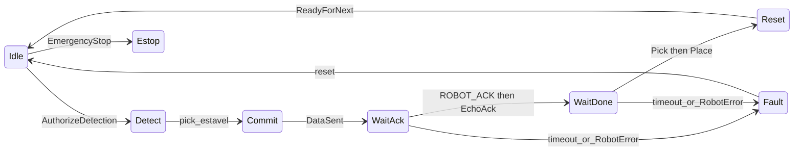

# FSM mínima NX102 — ciclo contínuo (fase de sincronização)

Contrato de tags: [TAG_CONTRACT.md](TAG_CONTRACT.md). **Não cria tags novas.** Modo manual na HMI (autorizar envio / Novo Ciclo) mantém-se; o caminho de campo é **contínuo**.

Estados internos do código (`WAITING_AUTHORIZATION`, `DETECTING`, …) mapeiam para os nomes curtos abaixo.

## Diagrama



## Tabela de tags

| Estado PC (lógico) | Estado código | Tags | Acção |
|--------------------|---------------|------|--------|
| Idle | `WAITING_AUTHORIZATION` | `VisionReady=True`, espera `RobotCtrl_AuthorizeDetection` | Não aceita detecção |
| Detect | `DETECTING` | visão (PickStabilizer) | `accepting_detections` |
| Commit | `SENDING_DATA` | `CENTROID_X/Y` mm, ângulo, área, confiança, `PRODUCT_DETECTED`, **`VisionCtrl_DataSent` por último** | `write_detection_result` |
| WaitAck | `WAITING_ACK` | `ROBOT_ACK` → `VisionCtrl_EchoAck=True` | Timeout `ack_timeout` |
| WaitDone | `WAITING_PICK` então `WAITING_PLACE` | `RobotStatus_PickComplete` / `PlaceComplete` | Timeouts pick/place |
| Reset | `WAITING_CYCLE_START` → `READY_FOR_NEXT` | `PlcCycleComplete` **OU** `PlcCycleStart`; senão Place feito e not Busy após `cycle_complete_timeout` | `ReadyForNext=True`, limpa DataSent/EchoAck/PRODUCT_DETECTED; contínuo volta a Idle |
| Estop | `SAFETY_BLOCKED` | `RobotCtrl_EmergencyStop=True` | Não lê Authorize |
| Fault | `ERROR` / `TIMEOUT` | `ROBOT_ERROR`, timeout, ACK residual no boot | Sem auto-pick |

**Invariantes:** uma pose por ciclo; `VisionBusy` de Commit até Reset; recovery no boot só Idle / Estop / Fault (nunca retomar Pick/Place sem pose).

**Coordenadas:** px → clamp ROI → `vision_to_robot` mm (`robot_controller._handle_sending_data`).

---

## Prompt para colar no Cursor (Box PC)

Copiar **só** o bloco abaixo para o chat Agent do Cursor, na pasta `realtec_vision_buddmeyer`.

```
Implementa o ciclo FSM mínimo contínuo PC ↔ NX102 neste repo. Não perguntes; altera o código.

Objectivo: com Modo contínuo na HMI, após Iniciar, o PC envia CENTROID_X/Y em mm, fecha pick→place e volta sozinho ao próximo ciclo. Sem clicar Novo Ciclo. Sem tags Sysmac novas.

NÃO alterar config/config.yaml (IP, ROI, CTI, mm_per_px, production_mode). NÃO redesenhar a HMI. NÃO forçar I/O do robô. Modo manual (autorizar envio / Novo Ciclo) pode ficar no código, mas o caminho contínuo tem de fechar o ciclo sozinho.

Ficheiros: control/robot_controller.py, control/plc_recovery.py, communication/cip_client.py (só SimulatedPLC se o handshake simulado quebrar), tests/test_fsm_handshake.py, tests/test_plc_recovery.py. Defaults novos só em config/settings.py.

Faz isto, se ainda não estiver feito:

1. WAITING_ACK: ao ler ROBOT_ACK=True, escrever VisionCtrl_EchoAck=True e ir directo a WAITING_PICK (não depender de ACK_CONFIRMED no caminho contínuo).
2. Reset (WAITING_CYCLE_START): fechar o ciclo se PlcCycleComplete OU PlcCycleStart for True. Se nenhum vier mas RobotPlaceComplete=True e RobotBusy=False após cycle_complete_timeout (default 3s), fechar na mesma. No fecho: EchoAck=False, DataSent=False, PRODUCT_DETECTED=False, ReadyForNext=True. Em contínuo, READY_FOR_NEXT → WAITING_AUTHORIZATION sem operador.
3. Recovery (plc_recovery.resolve_safe_state): no boot só SAFETY_BLOCKED, ERROR ou WAITING_AUTHORIZATION. Nunca aterrar em WAITING_PICK / WAITING_PLACE / WAITING_CYCLE_START. ROBOT_ACK residual → ERROR.
4. require_field_safety_tags default false: Safety_Gate/Area/Curtain NÃO bloqueiam o ciclo. Só RobotCtrl_EmergencyStop=True bloqueia. AuthorizeDetection=True tem de ser lido; não ficar preso em SAFETY_BLOCKED por tags de portão a False.
5. SimulatedPLC: no fim do ciclo simulado, CycleComplete também (não só CycleStart).

Testes: pytest tests/test_fsm_handshake.py tests/test_plc_recovery.py tests/test_safety_gate.py -q
Obrigatório passar: ciclo contínuo SimulatedPLC com cycle_count>=1; ciclo que só pulsa CycleComplete (sem CycleStart) também fecha; recovery não retoma pick.

Quando terminares, resume em 5 linhas o que mudaste e confirma que config.yaml não foi gravado.
```
